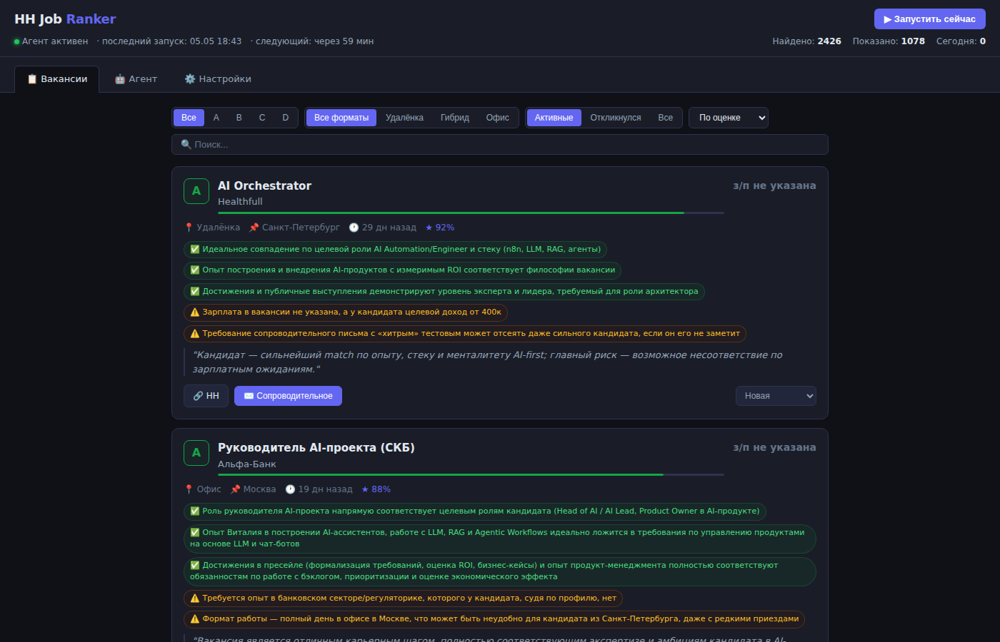

# HH Job Ranker

Инструмент для ранжирования и подготовки откликов на вакансии из **HH.ru**.

Агент находит вакансии, оценивает совпадение с вашим профилем через LLM, показывает результаты в веб-интерфейсе и готовит черновик сопроводительного письма — вы правите и отправляете.

> **Это не автоматический откликёр.** Это инструмент, который помогает быстрее находить релевантные вакансии и качественнее готовить персонализированные отклики. Решение о каждом отклике — за вами.



---

## Как это работает

Агент запускается по расписанию и при ручном запуске:

1. **Генерирует запросы** — LLM придумывает поисковые фразы на основе вашего профиля и предыдущих результатов
2. **Ищет на HH.ru** — Москва, Санкт-Петербург, удалёнка по всей РФ (Public API, без ключей)
3. **Оценивает вакансии** — LLM сравнивает каждую вакансию с вашим профилем, выставляет оценку A/B/C/D и score 0–100
4. **Дедуплицирует** — одна и та же вакансия из разных запросов не попадёт дважды
5. **Показывает в UI** — фильтры, поиск, пагинация, экспорт в CSV/JSON
6. **Готовит черновик письма** — по клику LLM маппит ваше резюме на требования вакансии и пишет сопроводительное. Вы редактируете текст, переходите на вакансию и вставляете в отклик

---

## Быстрый старт

**Требования:** Docker, API ключ [OpenRouter](https://openrouter.ai/keys) или [DeepSeek](https://platform.deepseek.com)

```bash
bash <(curl -fsSL https://raw.githubusercontent.com/vitalymt/hh-job-ranker/main/setup.sh)
```

Скрипт сам:
- Установит Docker если нет
- Склонирует репозиторий
- Спросит API ключ, модель, порт, интервал поиска
- Соберёт и запустит Docker контейнер

Через 30 секунд открывай `http://YOUR_VM_IP:8000`.

### Альтернативный вариант

```bash
git clone https://github.com/vitalymt/hh-job-ranker ~/hh-job-ranker
cd ~/hh-job-ranker
bash setup.sh
```

---

## Настройка под себя

Перед запуском отредактируй **один файл** — `config/profile.py`:

```python
CANDIDATE_PROFILE = """
Иван, 28 лет. Москва / удалёнка.
Целевой доход: от 250 000 ₽/мес.

ОПЫТ: ...
СТЕК: ...
ЦЕЛЕВЫЕ РОЛИ: ...
НЕ ИНТЕРЕСНО: ...
"""

SEED_QUERIES = [
    "python developer",
    "backend engineer",
    ...
]
```

`CANDIDATE_PROFILE` — свободный текст на любом языке. Чем подробнее опыт, стек и ожидания — тем точнее AI будет оценивать совпадение.

`SEED_QUERIES` — начальные запросы для первого цикла. После первого запуска AI генерирует новые сам, ориентируясь на то, что уже нашёл.

Также можно настроить промпты для оценки, генерации писем и запросов прямо в UI (вкладка ⚙️ Настройки).

---

## AI провайдеры

Поддерживается переключение прямо из UI (вкладка ⚙️ Настройки) без рестарта:

- **[OpenRouter](https://openrouter.ai)** — `sk-or-...` — `deepseek/deepseek-chat` — ~$0.0001/вакансия
- **[DeepSeek](https://platform.deepseek.com)** — `sk-...` — `deepseek-chat` — ~$0.00008/вакансия

Другие модели через OpenRouter: `anthropic/claude-haiku-4-5`, `openai/gpt-4o-mini`, `google/gemini-flash-1.5`.

---

## Telegram уведомления

Если задать переменные окружения `TELEGRAM_BOT_TOKEN` и `TELEGRAM_CHAT_ID`, агент будет присылать уведомления о каждой найденной вакансии класса A:

```bash
# В .env:
TELEGRAM_BOT_TOKEN=123456:ABC-DEF...
TELEGRAM_CHAT_ID=your_chat_id
```

---

## Конфигурация

Все настройки задаются при запуске `setup.sh` и сохраняются в `.env`. См. `.env.example` с комментариями.

| Переменная | Описание | По умолчанию |
|---|---|---|
| `OPENROUTER_API_KEY` | Ключ OpenRouter | — |
| `OPENROUTER_MODEL` | Модель OpenRouter | `deepseek/deepseek-chat` |
| `DEEPSEEK_API_KEY` | Ключ DeepSeek (опционально) | — |
| `DEEPSEEK_MODEL` | Модель DeepSeek | `deepseek-chat` |
| `AI_PROVIDER` | Активный провайдер | `openrouter` |
| `HH_USER_AGENT` | User-Agent для HH API | `HHJobRanker/1.0 (email)` |
| `PORT` | Порт веб-интерфейса | `8000` |
| `SEARCH_INTERVAL_HOURS` | Интервал поиска в часах | `2` |
| `MAX_PARALLEL_AI_REQUESTS` | Параллельных AI-запросов | `5` |
| `DB_PATH` | Путь к базе данных | `./data/jobs.db` |
| `TELEGRAM_BOT_TOKEN` | Токен Telegram-бота (опц.) | — |
| `TELEGRAM_CHAT_ID` | Chat ID для уведомлений (опц.) | — |
| `LOG_LEVEL` | Уровень логирования | `INFO` |

---

## Структура проекта

```
hh-job-ranker/
├── setup.sh              # Полный bootstrap: клон + Docker + запуск
├── main.py               # FastAPI приложение, все API роуты
├── agent.py              # Агентный цикл + APScheduler + Telegram
├── query_generator.py    # AI-генерация поисковых запросов
├── hh_client.py          # HH.ru Public API клиент (retry, backoff)
├── ai_client.py          # OpenRouter / DeepSeek клиент
├── ranker.py             # Параллельная batch-оценка вакансий
├── database.py           # SQLite + CRUD + пагинация + экспорт
├── logging_config.py     # Настройка логирования
├── config/
│   └── profile.py        # ← редактировать под себя
├── static/
│   └── index.html        # Весь фронтенд — один файл (Vanilla JS)
├── tests/
│   └── test_api.py       # Базовые тесты API
├── data/                 # SQLite база (gitignored, пересоздаётся)
├── Dockerfile
├── .env.example          # Шаблон переменных окружения
├── requirements.txt
└── pytest.ini
```

---

## API роуты

| Метод | Роут | Описание |
|---|---|---|
| `GET` | `/health` | Проверка здоровья (status, version, uptime) |
| `GET` | `/` | Веб-интерфейс |
| `GET` | `/api/vacancies` | Список вакансий (фильтры + пагинация) |
| `GET` | `/api/vacancies/export` | Экспорт вакансий (CSV/JSON) |
| `GET` | `/api/stats` | Статистика дашборда |
| `POST` | `/api/agent/run` | Запустить цикл поиска вручную |
| `GET` | `/api/agent/runs` | История запусков агента |
| `GET` | `/api/agent/queries` | Поисковые запросы и их эффективность |
| `POST` | `/api/cover-letter/{id}` | Сгенерировать сопроводительное письмо |
| `GET` | `/api/settings` | Получить настройки (ключи замаскированы) |
| `POST` | `/api/settings` | Обновить провайдер / модель / ключи |
| `PATCH` | `/api/vacancies/{id}/status` | Обновить статус вакансии |

---

## Полезные команды

```bash
# Смотреть логи в реальном времени
docker logs hh-ranker -f

# Остановить / запустить
docker stop hh-ranker
docker start hh-ranker

# Обновить до новой версии
cd ~/hh-job-ranker
git pull
docker build -t hh-ranker . --quiet
docker stop hh-ranker && docker rm hh-ranker
docker run -d --name hh-ranker --restart unless-stopped \
  -p 8000:8000 --env-file .env -v "$(pwd)/data:/app/data" hh-ranker

# Переустановить с нуля (сохраняет данные в data/)
bash setup.sh
```

---

## Стек

- **Backend**: Python 3.11, FastAPI, Uvicorn, aiosqlite, APScheduler, httpx
- **Frontend**: Vanilla JS, HTML/CSS (один файл, без фреймворков)
- **База данных**: SQLite
- **Деплой**: Docker (с health check)
- **AI**: OpenRouter API / DeepSeek API (OpenAI-совместимые)
- **Данные**: HH.ru Public API (без авторизации)

---

## Лицензия

MIT — используй как хочешь, адаптируй под свой профиль.
